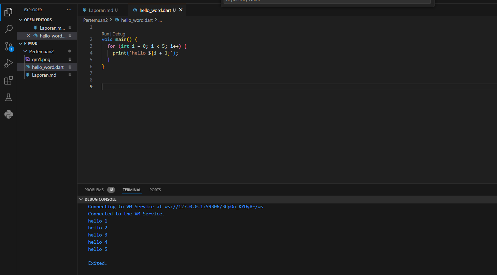
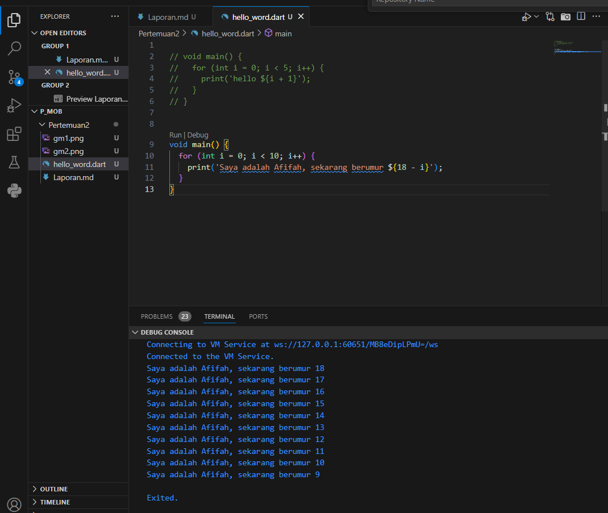

# LAPORAN PRAKTIKUM PERTEMUAN 2

## Pengantar Bahasa Pemrograman Dart - Bagian 1

Nama = Afifah Rahma Wahidha

Nim = 2241760088

Kelas = SIB 3D

# Percobaan 

## Soal

### 1.  Modifikasilah kode pada baris 3 di VS Code atau Editor Code favorit Anda berikut ini agar mendapatkan keluaran (output) sesuai yang diminta!

## hasil running 

### 2.Mengapa sangat penting untuk memahami bahasa pemrograman Dart sebelum kita menggunakan framework Flutter ? Jelaskan! 

    Jawab:
    memahami bahasa pemrograman Dart sangat penting, karena sebelum menggunakan Flutter karena Dart merupakan bahasa dasar untuk Flutter. Pengetahuan tentang Dart memudahkan pengembangan, debugging, penulisan kode yang bersih, serta penggunaan fitur dan library dalam Flutter secara efektif.
        

### 3. Rangkumlah materi dari codelab ini menjadi poin-poin penting yang dapat Anda gunakan untuk membantu proses pengembangan aplikasi mobile menggunakan framework Flutter.

    Jawab:

    - Program Dart
    Tujuan: Mengintegrasikan bahasa pemrograman modern dengan fitur-fitur terkini seperti alat produktif, pengelolaan memori otomatis (garbage collection), dan keamanan tipe data (type safety).
    Peran dalam Flutter: Dart berfungsi sebagai bahasa utama untuk pengembangan aplikasi, pembuatan plugin, dan manajemen dependensi di Flutter.

    - Evolusi Dart
    Sejarah: Diluncurkan pada tahun 2011 dengan tujuan awal menggantikan JavaScript. Seiring waktu, fokusnya bergeser ke pengembangan aplikasi mobile melalui Flutter.
    Perubahan Utama: Versi 2.0 yang dirilis pada tahun 2018 membawa fitur-fitur penting yang meningkatkan performa dan alat-alat pengembangan.

    - Cara Kerja Dart
    Eksekusi Kode: Kode Dart dapat dijalankan menggunakan Dart Virtual Machine (VM) atau dikompilasi menjadi JavaScript.
    Kompilasi: Menggunakan Just-In-Time (JIT) untuk pengembangan dan fitur hot reload, serta Ahead-Of-Time (AOT) untuk meningkatkan performa aplikasi pada produksi.

    - Struktur Bahasa Dart
    Sintaks: Memiliki sintaks yang mirip dengan bahasa pemrograman lain seperti C dan JavaScript.
    Pemrograman Berorientasi Objek (OOP): Mendukung prinsip-prinsip OOP seperti enkapsulasi, pewarisan, dan polimorfisme.
    Operator: Menyediakan berbagai operator termasuk aritmatika, penambahan/pengurangan, persamaan/relasional, dan logika.

    